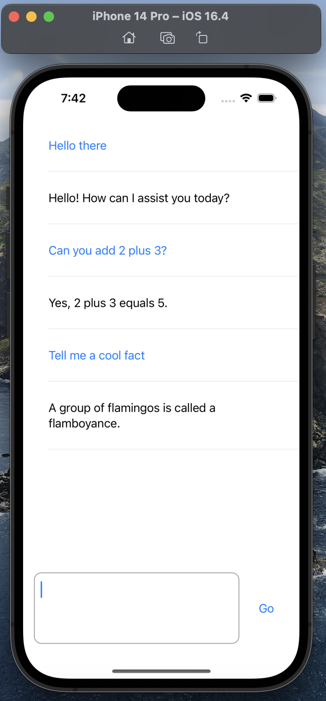

# ChatGPT on iOS
An iOS app made with SwiftUI using the MVVM architecture. 

This app uses the OpenAI API to generate realistic responses - similar to the ones made by ChatGPT.

# Note
If you want to clone this app, please note that you have first generate your own API key by going to https://platform.openai.com/account/api-keys, after creating an account.

# Screenshots

